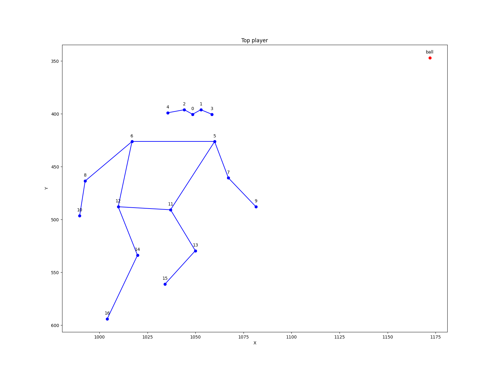
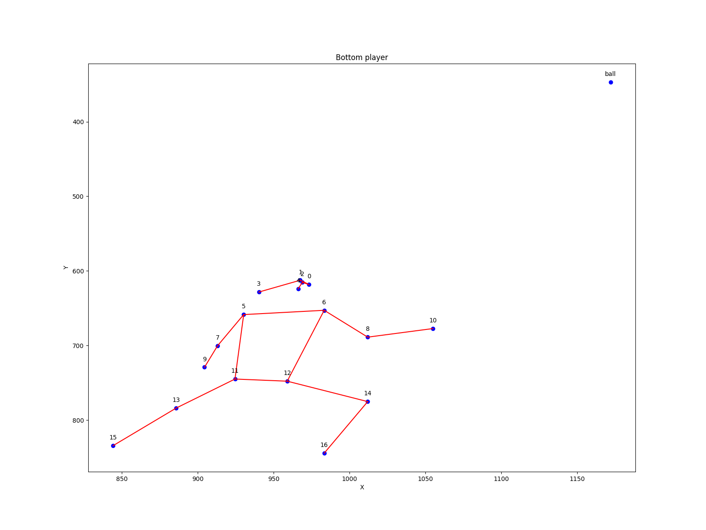
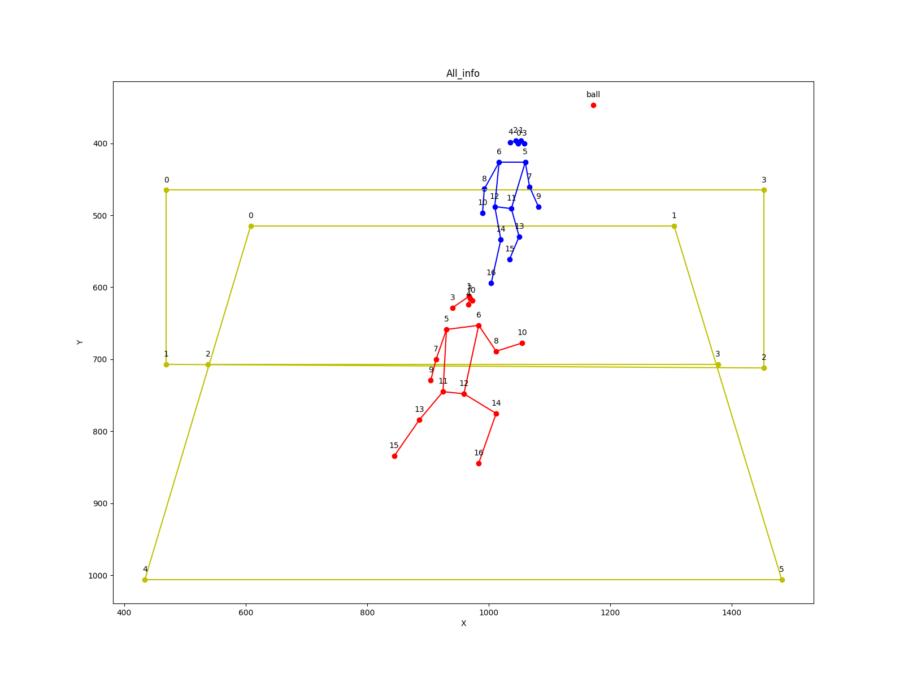

# SoloShuttlePose Usage & Examples
Here, we first list the flags and other parameters you can tune. Default parameters work well and you don't need to tune them unless you know what you are doing.

# Flags 

--folder_path: Folder path of the video to be processed. 

--result_path: Save paths for detection and drawing results. 

--force: Whether to process video that have already been processed, True is yes and False is not (Defaults False). 

--court: Whether to draw corut, True is yes and False is not (Defaults False).  

--net: Whether to draw net, True is yes and False is not (Defaults False).  

--players: Whether to draw players, True is yes and False is not (Defaults False).  

--ball: Whether to draw ball, True is yes and False is not (Defaults False).  

--trajectory: Whether to draw badminton flying trajectory, True is yes and False is not (Defaults False). 

--traj_len: set the trajectory length (Defaults 8). 

# Output formate & Schema

